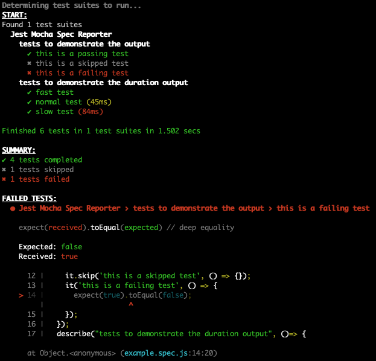

# Jest reporter with Mocha spec style logging

This is a fork of [peio](https://github.com/pierreroth64)'s
[jest-spec-reporter](https://github.com/pierreroth64/jest-spec-reporter#readme), tweaking it to look like Mocha's spec reporter.

Here is the output of `npm run example`:



## Installation

You may install this package as a development dependency:

```bash
npm install --save-dev jest-mocha-spec-reporter
```

## Configuration

Configure [Jest](https://facebook.github.io/jest/docs/en/configuration.html) to use the reporter.

For example, create a `jest.config.js` file containing:

```javascript
module.exports = {
  verbose: false,
  testPathIgnorePatterns: ["/node_modules/"],
  reporters: ["jest-mocha-spec-reporter"]
};
```
